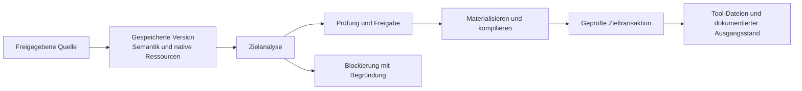

# Wie OAAM funktioniert

[English](ARCHITECTURE.md) · [简体中文](ARCHITECTURE.zh-CN.md) · [日本語](ARCHITECTURE.ja.md) · [Deutsch](ARCHITECTURE.de.md) · [README](README.de.md)

Coding-Tools unterscheiden sich in mehr als Dateinamen. Regeln haben Geltungsbereiche, Workflows eigene
Aufrufmodelle und Skills mitunter ein ganzes Verzeichnis an Abhängigkeiten. OAAM behandelt diese Inhalte
als Assets mit Bedeutung und Historie und plant, wie ein konkretes Tool sie nutzen kann. Das Ergebnis soll
eine prüfbare Konvertierung und eine wiederherstellbare Bereitstellung sein; die gespeicherte Ausgangsversion bleibt erhalten.

## Von nativen Dateien zum semantischen Modell

Ein Adapter kennt Pfade, Formate und Laderegeln seiner Tool-Familie. Er liest nur die ausgewählte und
freigegebene Quelle und erzeugt strukturierte Inhalte für Guidance, Rule, Workflow, Skill, Subagent oder
Memory. Eine gespeicherte Version verbindet diese gemeinsame Darstellung mit dem Quelldialekt und den
nativen Ressourcen. Vollständige Verzeichnis-Assets behalten Dateibytes, relative Pfade, Ausführungsattribute
und die Verzeichnisstruktur einschließlich leerer Verzeichnisse. Spätere Ausgaben lassen sich daraus erzeugen,
ohne die aktuelle Quelle erneut zu lesen.

Die gemeinsame Darstellung bildet die Grundlage der Analyse. Sie setzt nicht voraus, dass alle Tools
dasselbe meinen. Core leitet für jedes Asset und jede Datei die erforderliche Semantik ab; Adapter schlagen
passende Nutzungsmöglichkeiten für den konkreten Tool-Einstieg vor. Dabei zählen Anwendbarkeit, nicht
unterstützte Details, Informationsverlust und die spätere Rückgewinnung externer Änderungen. Core wählt
kompatible Ausgabeeinheiten, klärt die Zuständigkeit für gemeinsame Pfade und prüft nötige Freigaben.
Erst dann erzeugen Adapter die Bytes. Core prüft die semantische Abdeckung und kompiliert einen vollständigen Zielplan.



Ein Beispiel ist ein Skill mit SKILL.md, references/checklist.md und einem ausführbaren scripts/check.sh.
Nur den Markdown-Einstieg zu speichern würde einen unvollständigen Skill hinterlassen. OAAM bewahrt die
zugehörige Ressourcenstruktur und analysiert die gesamte Ausgabe. Kann das Ziel die Ressourcen erhalten,
aber eine Aufrufeinstellung nicht ausdrücken, muss die Analyse diese Einstellung berücksichtigen: auf einem
unterstützten Weg erhalten, eine zulässige Einschränkung zur Freigabe offenlegen oder die Konvertierung
blockieren. Die Einstellung still zu entfernen, um Erfolg zu melden, ist kein gültiger Weg. Bei passendem
Quelldialekt können native Inhalte erhalten bleiben, ohne jedes private Feld in das gemeinsame Modell zu zwingen.

Kompatibilität gilt deshalb für den konkreten Tool-Einstieg, Asset-Typ, die Richtung, Plattform und den
erkannten Build. Ein erfolgreicher Import belegt weder Bereitstellung noch Rückübernahme. Gültig geschriebene
Dateien beweisen auch nicht, dass ein externes Tool sie tatsächlich geladen hat.

### Aufrufeinstellungen

Ein Skill, der nur auf ausdrücklichen Nutzeraufruf ausgeführt werden soll, enthält neben Anweisungen auch eine Aufrufbedingung. Sowohl [Claude Code](https://code.claude.com/docs/en/skills) als auch [Cursor](https://cursor.com/docs/skills) dokumentieren dafür `disable-model-invocation: true`. OAAM behandelt diese Einstellung ausdrücklich:

| Schritt | Darstellung |
| --- | --- |
| Nativen Skill lesen | `disable-model-invocation: true` aus dem Frontmatter lesen. |
| Bedeutung speichern | `invocation.model.mode: disabled` erfassen; der Nutzeraufruf ist ein eigenes Feld. |
| Für ein passendes Ziel ausgeben | Die Skill-Renderer für Claude Code und Cursor schreiben `disable-model-invocation: true`. |

Nicht jede Aufrufsteuerung ist austauschbar. Claudes `user-invocable: false` ist eine andere Einschränkung. Der aktuelle Cursor-Konverter für das gemeinsame Modell setzt direkte Nutzeraufrufe voraus und lehnt diesen Fall ab. Siehe [Claude-Parser](../packages/adapter/providers/claudecode/src/claudecode-source-read-skill.ts), [Cursor-Parser](../packages/adapter/providers/cursor/src/cursor-source-read-skill.ts) und [Cursor-Ziel](../packages/adapter/providers/cursor/src/cursor-target-skill.ts).

### Modellwahl und Denkaufwand

OAAM speichert die angegebene Modell- oder Effort-Auswahl und den Quelldialekt. Kann der Quelladapter die Auswahl einordnen, kommt eine relative Stufe hinzu. Der [Claude-Quelladapter](../packages/adapter/providers/claudecode/src/claudecode-source-read-fields.ts) erfasst `effort: high` beispielsweise so:

```json
{
  "mode": "selected",
  "dialectId": "claudecode-effort-selector-v1",
  "selector": "high",
  "relativeTier": 7
}
```

Die Stufen 1–10 beschreiben eine Reihenfolge innerhalb der Modellfamilie oder Effort-Skala der Quelle. Sie sind weder Aufruffrequenz noch ein herstellerübergreifender Leistungstest. Unbekannte Werte behalten ihren ursprünglichen selector und erhalten die Stufe `-1`.

Das Erfassen und Prüfen dieser Absicht ist implementiert; eine gleichwertige Modellwahl für jedes Ziel ist es nicht. Die aktuellen Skill-Konverter für das gemeinsame Modell für [Claude Code](../packages/adapter/providers/claudecode/src/claudecode-target-skill-canonical.ts) und [Cursor](../packages/adapter/providers/cursor/src/cursor-target-skill.ts) verlangen geerbte Modell- und Effort-Einstellungen. Eine ausdrückliche Auswahl kann diese Konvertierungswege nicht nutzen. Native Erhaltung und andere Zielvorschläge müssen separat geprüft werden. Eine Stufe allein erlaubt weder einen Ersatz noch den Verlust einer Einstellung.

## Bereitstellung mit Grundlage für die Wiederherstellung

Eine Vorschau ist an die geprüfte Version, das Ziel und den aktuellen Berechtigungsstand gebunden. Core
prüft diese Eingaben beim Ausführen erneut. Adapter schlagen Inhalte vor; sie schreiben oder löschen keine Tool-Dateien selbst.

Bei einer bestätigten vollständigen Ersetzung gibt der Nutzer die gewünschte Version und einen ausdrücklich
benannten physischen Bereich frei. Unter den Zielsperren erfasst Core dessen tatsächlichen Inhalt zu Beginn
des Vorgangs als alten Zustand für die Wiederherstellung, einschließlich dortiger Änderungen seit der Vorschau.
Außerhalb dieses Bereichs bleibt der Schutz des geprüften Zustands bestehen. Unerwartete Änderungen während
der Ausführung und unklare Schreibergebnisse stoppen weiterhin den Fortgang.

Vor Zieländerungen schreibt Core ein dauerhaftes Journal und bereitet neue Dateien oder vollständige verwaltete
Verzeichnisbäume an einem dauerhaften Zwischenablageort im selben Dateisystem vor. Verzeichnisbäume werden
außerhalb der Ladecontainer des Tools vorbereitet. Shared veröffentlicht die vorbereiteten Datei- oder
Verzeichniseinträge an ihren deklarierten Grenzen. Core protokolliert den Fortschritt, prüft das Ergebnis und
speichert anschließend den angewendeten Snapshot und Ausgangsstand. Für die Wiederherstellung stehen damit
sowohl die geplante Ausgabe als auch der tatsächliche Inhalt vor dem Vorgang zur Verfügung.

Diese Garantien haben eine klare Reichweite: Eine Bereitstellung mit mehreren Dateien ist keine einzelne
atomare Transaktion über die gesamte Bibliothek und alle Tools. Bei Konflikten, Unterbrechungen oder einem
unklaren Schreibergebnis kann ein Wiederherstellungsjournal verbleiben. Die Wiederherstellung vergleicht
die dokumentierte Berechtigung mit den tatsächlichen Dateien und wählt einen gültigen alten oder neuen
Zustand. Mehrdeutige oder fremde Änderungen stoppen den automatischen Fortgang.

Unterstützte externe Änderungen können nach einer eigenen Rückübernahmeprüfung zu einer neuen gespeicherten
Version werden. Frühere Versionen bleiben erhalten. Das ist ein ausdrücklicher Vorgang, kein automatischer
Merge und keine Dauersynchronisierung. Die Wiederherstellung eines vollständigen Zustandsbackups ist ein
anderer Vorgang: Sie stellt den gespeicherten Verwaltungszustand als Einheit wieder her und erfindet keine
fehlende Bereitstellungshistorie aus zufällig vorhandenen Dateien im Tool-Verzeichnis.

## Getrennte Verantwortlichkeiten

| Schicht | Verantwortung |
| --- | --- |
| Client | Desktop oder Headless kommunizieren über das gemeinsame Protokoll und zeigen Prüfungen sowie Nutzerentscheidungen. |
| Host und Bootstrap | Host verwaltet Anwendungslebenszyklus und Protokollprojektion. Bootstrap stellt Core und die konkreten Provider zusammen. |
| Core | Versionierte Assets, semantische Auswahl, Freigaben, Zielkompilierung, Journale, Zustand und Wiederherstellung. |
| Adapter | Tool-spezifische Erkennung, Parsing, Dialekte, Laderegeln und Ausgabevorschläge. |
| Shared | Physische Pfade, begrenzte Prozessoperationen, Sperren und für das Build-Ziel ausgewählte Dateisystemmechanismen. |

Beim Zugriff von Windows auf eine ausgewählte WSL-Umgebung bleibt der Verwaltungszustand unter Windows.
Ein eingeschränkter Dienst führt die freigegebenen Zieloperationen innerhalb der ausgewählten Linux-Umgebung
aus. Linux-Dateisystemarbeit bleibt dort lokal und wird nicht wie gewöhnlicher Windows-Dateizugriff behandelt.
Diese Aufteilung gilt für diesen umgebungsübergreifenden Weg; lokale Windows- und lokale Linux/WSL-Ausführung
verwenden nicht pauschal dieselbe entfernte Anordnung.

## Die Implementierung lesen

- [Importmaterial](../packages/core/src/orchestration/import-material.ts) setzt den Inhalt einer gespeicherten Version zusammen.
- [Erforderliche Semantik](../packages/core/src/render/render-semantics.ts), [Analyse](../packages/core/src/render/render-analysis-orchestrator.ts), [Materialisierung](../packages/core/src/render/render-materialization.ts) und [Compiler](../packages/core/src/render/render-compiler.ts) bilden den Konvertierungsweg.
- [Deployment-Executor](../packages/core/src/deployment/deployment-executor.ts), [Zieltransaktion](../packages/core/src/deployment/deployment-target-transaction.ts) und [Wiederherstellung](../packages/core/src/deployment/deployment-recovery.ts) setzen die geprüfte Bereitstellung um.
- [Rückübernahme](../packages/core/src/reverse/reverse-accept-service-runtime.ts), [Provider](../packages/adapter/providers/) und [Shared](../packages/shared/src/) zeigen die weiteren Grenzen.

Die öffentlichen Prüfungen testen diese Grenzen mit synthetischen Assets, Konflikt- und Wiederherstellungsfällen,
vollständigen Ressourcenstrukturen und tatsächlicher Desktop-Darstellung. Befehle und genaue Quellcode- und
Plattformgrenzen stehen unter [Bauen und testen](BUILD.de.md), der Ablauf unter [Verwendung](USAGE.de.md).
Chat-Inhalte, Zugangsdaten, private Sitzungen, pluginprivate Daten und vom Tool verwaltete eingebaute Inhalte gehören nicht zum Asset-Modell.
