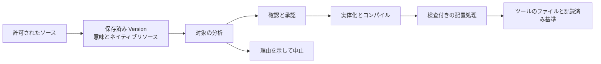

# OAAM の技術設計

[English](ARCHITECTURE.md) · [简体中文](ARCHITECTURE.zh-CN.md) · [日本語](ARCHITECTURE.ja.md) · [Deutsch](ARCHITECTURE.de.md) · [README](README.ja.md)

コーディングツールの違いはファイル名だけではありません。ルールには適用範囲があり、ワークフローには呼び出し方式があり、
スキルはディレクトリ全体に依存することがあります。OAAM はそれらを意味と履歴を持つアセットとして保存し、具体的なツールで
どう使えるかを計画します。元の保存済みバージョンを残しながら、変換を確認でき、配置の失敗から復旧できる仕組みを目指しています。

## ネイティブファイルから意味のモデルへ

Adapter はツールのファミリーごとのパス、形式、読み込み規則を理解します。選択・許可されたソースだけを読み、Guidance、Rule、
Workflow、Skill、Subagent、Memory のいずれかに対応する構造化された内容を作ります。保存する Version は、その共通表現に加え、
ソースの方言とネイティブリソースを保持します。完全なディレクトリアセットでは、バイト列、相対パス、実行属性、空ディレクトリを
含むディレクトリ構成も残します。後の出力生成では、現在のソースを読み直さずに保存済みの内容を再構成できます。

共通表現は分析の土台であり、すべてのツールで意味が一致するという約束ではありません。Core はアセットとファイルごとに
処理すべき意味を導出し、Adapter は対象ツールの具体的な入口に合わせた利用方法を提案します。分析では適用条件、未対応の詳細、
情報の損失、後から編集内容を抽出できるかを扱います。Core が互換性のある出力単位と共有パスの所有者を決め、必要な承認を確認した
後で、Adapter が実際のバイト列を生成します。Core は意味の網羅性を検証し、完全な配置計画にコンパイルします。



例えば SKILL.md、references/checklist.md、実行可能な scripts/check.sh を持つスキルを考えます。入口の Markdown だけを保存すると、
スキルの機能が欠けます。OAAM は所有するリソースの構造を保存し、出力全体を分析します。対象がリソースを保持できても呼び出し設定を
表現できないなら、その設定を扱う必要があります。対応する方法で保持するか、許容される機能低下を説明して承認を求めるか、変換を
中止します。成功と表示するために黙って設定を削除することはできません。方言が一致する場合には、独自フィールドをすべて共通モデルへ
押し込めずに、ネイティブの内容を保持する方法もあります。

そのため互換性は、ツールの入口、アセットの種類、操作の方向、OS、検出されたビルドごとに判断します。取り込み成功は配置や逆取り込みの
対応を意味せず、有効なファイルを作れたことも外部ツールが実際に読み込んだ証拠にはなりません。

### 呼び出し方式

手動で呼び出したときだけ使う設定の Skill には、本文だけでなく呼び出し条件もあります。[Claude Code](https://code.claude.com/docs/en/skills) と [Cursor](https://cursor.com/docs/skills) は、どちらも `disable-model-invocation: true` をこの設定として説明しています。OAAM は明示的に扱います。

| 段階 | 表現 |
| --- | --- |
| ネイティブの Skill を読む | frontmatter の `disable-model-invocation: true` を解析します。 |
| 意味を保存する | `invocation.model.mode: disabled` を記録します。ユーザーによる呼び出しは別のフィールドです。 |
| 対応する対象へ出力する | Claude Code と Cursor の Skill レンダラーが `disable-model-invocation: true` を出力します。 |

すべての呼び出し制御が置き換え可能なわけではありません。Claude の `user-invocable: false` は別の制限です。現在の Cursor 向け共通モデル変換器はユーザーの直接呼び出しを必要とするため、この場合は変換を拒否します。[Claude の読み取り処理](../packages/adapter/providers/claudecode/src/claudecode-source-read-skill.ts)、[Cursor の読み取り処理](../packages/adapter/providers/cursor/src/cursor-source-read-skill.ts)、[Cursor の出力処理](../packages/adapter/providers/cursor/src/cursor-target-skill.ts)を参照してください。

### モデル選択と思考強度

OAAM は指定されたモデルや思考強度、ソースの方言を保存し、ソース Adapter が分類できる場合には相対段階も記録します。例えば [Claude のソース Adapter](../packages/adapter/providers/claudecode/src/claudecode-source-read-fields.ts) は `effort: high` を次のように記録します。

```json
{
  "mode": "selected",
  "dialectId": "claudecode-effort-selector-v1",
  "selector": "high",
  "relativeTier": 7
}
```

1–10 はソース側のモデル系列や思考強度の順序です。呼び出し頻度でも、ベンダー間の性能スコアでもありません。不明な指定は元の selector を残し、段階を `-1` にします。

この意図の記録と検証は実装済みですが、任意の対象で同等のモデルを選ぶ仕組みが完成しているわけではありません。現在の [Claude Code](../packages/adapter/providers/claudecode/src/claudecode-target-skill-canonical.ts) と [Cursor](../packages/adapter/providers/cursor/src/cursor-target-skill.ts) 向けの共通モデル変換器は、Skill のモデルと思考強度が継承設定であることを要求します。明示的な指定にはこの変換経路を使えません。ネイティブ形式の保持や別の出力案は個別に分析し、段階だけを根拠に置換や設定の損失を承認することはありません。

## 復旧の根拠を残す配置

プレビューは確認した Version、対象、現在の権限状態に結び付いており、Core が実行時に再確認します。Adapter は内容を提案しますが、
ツールのファイルを自ら書き込んだり削除したりしません。

完全置換を確認する場合、ユーザーが承認するのは配置したい Version と明示された物理的な範囲です。Core は対象をロックしてから、
その範囲の操作開始時点の実際の内容を復旧用の旧状態として記録します。範囲内でプレビュー後に行われた編集も含まれます。
承認範囲外では確認済み状態の保護を維持し、実行中の予期しない変更や書き込み結果が不明な状態では処理を止めます。

対象を変更する前に、Core は永続的な journal を記録し、同じファイルシステムの永続的な一時保管場所へ新しいファイルや管理対象の
ディレクトリツリーを準備します。ディレクトリの保管場所はツールの読み込み対象コンテナの外です。Shared が宣言されたファイルまたは
ディレクトリの境界で準備済みの入口を公開し、Core が進捗を記録して結果を検証した後、適用済みスナップショットと基準状態を保存します。
これにより復旧時には、意図した出力と操作直前の実際の内容の両方を参照できます。

保証には粒度があります。複数ファイルの配置を、ライブラリ全体とすべてのツールにまたがる一つの原子トランザクションとはしていません。
競合、中断、書き込み結果が不明な状態では、復旧用の journal が残る場合があります。復旧は記録された権限と実際のファイルを確認して、
成立する旧状態または新状態を選びます。曖昧さや外部の変更がある場合は自動処理を止めます。

対応する外部編集は、独立した逆取り込みの確認を経て新しい Version にできます。過去の Version は残ります。これは明示的な操作であり、
自動マージや常時同期ではありません。状態全体のバックアップ復元は別の操作です。保存した管理状態を一括で復元し、ツールのディレクトリに
たまたま存在するファイルから失われた配置履歴を推測しません。

## 各層の責任

| 層 | 責任 |
| --- | --- |
| Client | Desktop または Headless が共通プロトコルで対話し、確認内容とユーザーの選択を扱います。 |
| Host と Bootstrap | Host はアプリのライフサイクルとプロトコルへの投影を、Bootstrap は Core と具体的な Provider の構成を担当します。 |
| Core | バージョン付きアセット、意味に基づく選択、承認、配置計画のコンパイル、journal、状態、復旧。 |
| Adapter | ツール固有の発見、解析、方言、読み込み規則、出力提案。 |
| Shared | 物理パス、有界のプロセス操作、ロック、ビルド対象に選ばれたファイルシステム機構。 |

Windows から選択した WSL を管理する経路では、Windows が管理状態を保持し、制限されたサービスが選択した Linux 環境内で許可された
対象操作を実行します。Linux のファイルシステム操作はその環境内で行い、通常の Windows ファイルアクセスとして扱いません。
この分担はその環境間経路に固有です。ローカルの Windows や Linux/WSL まで、すべて同じリモート構成を使うわけではありません。

## 実装を読む

- [取り込み材料](../packages/core/src/orchestration/import-material.ts)が保存する Version の内容を組み立てます。
- [必要な意味](../packages/core/src/render/render-semantics.ts)、[分析](../packages/core/src/render/render-analysis-orchestrator.ts)、[実体化](../packages/core/src/render/render-materialization.ts)、[コンパイラー](../packages/core/src/render/render-compiler.ts)が変換を実装します。
- [配置実行器](../packages/core/src/deployment/deployment-executor.ts)、[対象トランザクション](../packages/core/src/deployment/deployment-target-transaction.ts)、[復旧](../packages/core/src/deployment/deployment-recovery.ts)が検査付きの配置を実装します。
- [逆取り込み](../packages/core/src/reverse/reverse-accept-service-runtime.ts)、[Providers](../packages/adapter/providers/)、[Shared](../packages/shared/src/)から他の境界を確認できます。

公開テストは、架空のアセット、競合と復旧、完全なリソース構造、デスクトップの実描画でこれらの境界を検証します。
コマンドと正確なソース・OS の対象範囲は[ビルドとテスト](BUILD.ja.md)、操作の流れは[使い方](USAGE.ja.md)にあります。
チャット本文、認証情報、プライベートセッション、プラグイン専用データ、ツール管理の組み込み内容は対象外です。
