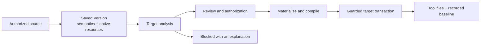

# How OAAM works

[English](ARCHITECTURE.md) · [简体中文](ARCHITECTURE.zh-CN.md) · [日本語](ARCHITECTURE.ja.md) · [Deutsch](ARCHITECTURE.de.md) · [README](../README.md)

Coding tools disagree about more than filenames. A rule can have a scope, a workflow can have an invocation
model, and a skill can depend on an entire directory. OAAM treats these as assets with meaning and history,
then plans how a particular tool can consume them. The useful result is a reviewable conversion and a
recoverable deployment, with the original saved version still available.

## From native files to a semantic model

An Adapter knows its tool family's paths, formats and loading rules. It reads only the selected, authorized
source and produces structured content for one of six kinds: Guidance, Rule, Workflow, Skill, Subagent or
Memory. A saved Version combines that common representation with the source dialect and its native resources.
Complete directory assets retain file bytes, relative paths, executable attributes and directory membership,
including empty directories. Later rendering does not need to reread the live source to reconstruct that version.

The common representation is a basis for analysis, not a promise that every tool means the same thing.
Core derives the required semantics for each asset and file; Adapters propose ways for the exact target
entry to consume them. Analysis accounts for applicability, unsupported details, loss and the ability to
extract later edits. Core chooses compatible output units, resolves shared-path ownership and checks the
necessary authorization before asking Adapters to produce bytes. It then validates semantic coverage and
compiles one complete target plan.



Consider a skill containing SKILL.md, references/checklist.md and an executable scripts/check.sh. Saving
only the Markdown entry would leave a broken skill. OAAM saves the owned resource graph and analyzes the
whole proposed output. If a target can preserve those resources but cannot express an invocation setting,
the analysis must account for that setting: preserve it where supported, disclose a supported downgrade
for approval, or block. It cannot silently remove the setting to report success. Matching source dialects
also allow native content to be retained without squeezing every private field into the common model.

This is why compatibility is specific to the tool entry, asset kind, direction, platform and detected build.
A successful import does not establish deploy or reverse support; writing valid files does not prove that
an external tool actually loaded them.

### Invocation settings

A Skill configured to run only on a user’s explicit invocation carries behavior as well as instructions. Both [Claude Code](https://code.claude.com/docs/en/skills) and [Cursor](https://cursor.com/docs/skills) document `disable-model-invocation: true` for this purpose. OAAM handles this setting explicitly:

| Stage | Representation |
| --- | --- |
| Read the native Skill | Parse `disable-model-invocation: true` from its frontmatter. |
| Save the meaning | Record `invocation.model.mode: disabled`; user invocation is a separate field. |
| Render a compatible target | The Claude Code and Cursor Skill renderers emit `disable-model-invocation: true`. |

This does not make every invocation control interchangeable. Claude's `user-invocable: false` expresses a separate restriction; the current Cursor canonical converter requires direct user invocation and rejects that case. See the [Claude reader](../packages/adapter/providers/claudecode/src/claudecode-source-read-skill.ts), [Cursor reader](../packages/adapter/providers/cursor/src/cursor-source-read-skill.ts) and [Cursor target](../packages/adapter/providers/cursor/src/cursor-target-skill.ts).

### Model choice and thinking effort

OAAM also records the authored model or effort choice, its source dialect and a relative tier when the source adapter can classify it. For example, the [Claude source adapter](../packages/adapter/providers/claudecode/src/claudecode-source-read-fields.ts) records `effort: high` as:

```json
{
  "mode": "selected",
  "dialectId": "claudecode-effort-selector-v1",
  "selector": "high",
  "relativeTier": 7
}
```

The 1–10 tier represents order within the source model family or effort scale. It is not invocation frequency or a benchmark across vendors. Unknown choices retain their original selector with tier `-1`.

Recording and validating this intent is implemented; selecting an equivalent model in every target is not. The current conversion routes through the common Skill model for [Claude Code](../packages/adapter/providers/claudecode/src/claudecode-target-skill-canonical.ts) and [Cursor](../packages/adapter/providers/cursor/src/cursor-target-skill.ts) require inherited model and effort settings. An explicit selection cannot use those conversion routes. Native preservation and any other proposed target route must be assessed separately; a tier alone never authorizes a substitution or loss.

## Deployment with a recorded basis for recovery

A preview is bound to the reviewed Version, target and current authority. Core rechecks these inputs when
the action runs. Adapters propose content; they do not write or delete runtime files themselves.

For a confirmed complete replacement, the user approves the desired Version and an explicit physical
scope. Under the target locks, Core captures the actual content in that scope at operation start as the
recovery old side, including edits made there after preview. Paths outside the approved scope retain their
reviewed-state protections. Unexpected changes during execution and uncertain writes still stop progress.

Before target changes, Core records a durable journal and prepares the new files or managed directory trees
in persistent staging on the same filesystem. Directory staging stays outside the tool's loading containers.
Shared publishes the prepared file or directory entries at their declared boundaries; Core records progress,
verifies the result, then commits the applied snapshot and baseline. This makes both the intended output
and the actual pre-operation content available to recovery.

These guarantees have a boundary: a deployment spanning several files is not advertised as one atomic
transaction across the entire library and every tool. A conflict, interruption or uncertain write can leave
a recovery journal. Recovery checks the recorded authority and actual files before choosing a valid old or
new state; ambiguous or foreign changes block automatic progress.

Supported external edits can travel back through a separate reverse-accept review and become a new saved
Version. Earlier versions remain. This is an explicit operation, not an automatic merge or continuous sync.
Whole-state backup restoration is another operation: it restores the saved management state as a unit and
does not infer missing deployment history from whatever files happen to exist in a tool directory.

## Responsibilities stay separate

| Layer | Responsibility |
| --- | --- |
| Client | Desktop or Headless interaction through the shared protocol; presents reviews and user choices. |
| Host and Bootstrap | Host owns application lifecycle and protocol projection. Bootstrap assembles Core and the concrete Providers. |
| Core | Versioned assets, semantic selection, authorization, target compilation, journals, state and recovery. |
| Adapter | Tool-specific discovery, parsing, dialects, loading rules and rendering proposals. |
| Shared | Physical paths, bounded process operations, locks and filesystem mechanisms selected for the built target. |

For the Windows-to-selected-WSL path, Windows retains management state while a restricted service executes
the authorized target operations inside the selected Linux environment. Linux filesystem work stays local
to that environment instead of being treated as ordinary Windows file access. This split is specific to that
cross-environment path; local Windows and local Linux/WSL execution do not all use the same remote arrangement.

## Read the implementation

- [Import material](../packages/core/src/orchestration/import-material.ts) assembles a saved Version's content.
- [Required semantics](../packages/core/src/render/render-semantics.ts), [analysis](../packages/core/src/render/render-analysis-orchestrator.ts), [materialization](../packages/core/src/render/render-materialization.ts) and [compiler](../packages/core/src/render/render-compiler.ts) implement the conversion path.
- [Deployment executor](../packages/core/src/deployment/deployment-executor.ts), [target transaction](../packages/core/src/deployment/deployment-target-transaction.ts) and [recovery](../packages/core/src/deployment/deployment-recovery.ts) implement guarded delivery.
- [Reverse accept](../packages/core/src/reverse/reverse-accept-service-runtime.ts), [Providers](../packages/adapter/providers/) and [Shared](../packages/shared/src/) show the remaining boundaries.

The public checks exercise these boundaries with synthetic assets, conflict and recovery cases, complete
resource graphs and actual Desktop rendering. See [build and test](BUILD.md) for commands and the precise
source/platform scope, or [usage](USAGE.md) for the user journey. Chat bodies, credentials, private sessions,
plugin-private data and tool-managed built-ins are outside the asset model.
