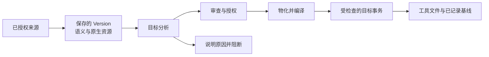

# OAAM 的技术设计

[English](ARCHITECTURE.md) · [简体中文](ARCHITECTURE.zh-CN.md) · [日本語](ARCHITECTURE.ja.md) · [Deutsch](ARCHITECTURE.de.md) · [README](README.zh-CN.md)

编程工具之间的差异远不止文件名。规则可能带有适用范围，工作流可能依赖特定调用方式，技能也可能依赖整个目录。
OAAM 将这些内容视为有语义、有历史的资产，再规划具体工具如何使用它们。目标是让转换可审查、部署可恢复，
同时保留原先保存的版本。

## 从原生文件到语义模型

Adapter 了解工具家族的路径、格式和加载规则，只读取用户选定并授权的来源，将内容解析为 Guidance、Rule、
Workflow、Skill、Subagent、Memory 六类结构化资产。保存的 Version 同时包含统一表示、来源方言和原生资源。
完整目录资产保留文件字节、相对路径、可执行属性和目录成员，包括空目录。后续渲染可以从保存的版本重建内容，
无需重新读取实时来源。

统一表示为分析提供基础，并不假定所有工具的含义完全一致。Core 从每项资产、每个文件推导必须处理的语义，
Adapter 为精确的目标工具入口提出消费方案。分析覆盖适用条件、不支持的细节、信息损失，以及日后能否抽取外部修改。
Core 选择兼容的输出单元，确定共享路径的所有权，并检查必要授权，再让 Adapter 生成实际字节。
最后由 Core 校验语义覆盖范围，编译为一个完整目标计划。



例如，一个技能包含 SKILL.md、references/checklist.md 和可执行的 scripts/check.sh。只保存入口 Markdown
会留下无法完整工作的技能。OAAM 保存它拥有的资源图，并分析完整输出。如果目标能够保留资源，却无法表达某项
调用设置，分析必须对该设置给出处理：在支持的路径保留、披露允许的降级并请求确认，或阻断转换；不能悄悄删掉它
来报告成功。匹配来源方言时，还能保留原生内容，无需强行把每个私有字段压进统一模型。

因此，兼容性按工具入口、资产种类、操作方向、平台和检测到的构建分别判断。导入成功不等于支持部署或反向接纳；
写出了合法文件，也不等于外部工具已经实际加载。

### 调用方式

设为仅在用户手动调用时运行的 Skill，除了正文，还带有调用约束。[Claude Code](https://code.claude.com/docs/en/skills) 和 [Cursor](https://cursor.com/docs/skills) 都用 `disable-model-invocation: true` 表达这一设置。OAAM 会明确处理它：

| 阶段 | 表示方式 |
| --- | --- |
| 读取原生 Skill | 从 frontmatter 解析 `disable-model-invocation: true`。 |
| 保存语义 | 记录 `invocation.model.mode: disabled`；用户调用方式另用独立字段表示。 |
| 渲染兼容目标 | Claude Code 和 Cursor 的 Skill 渲染器输出 `disable-model-invocation: true`。 |

调用控制并非都能互换。Claude 的 `user-invocable: false` 表达另一项限制；当前 Cursor 通用语义转换器要求允许用户直接调用，因此会拒绝这种情况。实现见 [Claude 读取器](../packages/adapter/providers/claudecode/src/claudecode-source-read-skill.ts)、[Cursor 读取器](../packages/adapter/providers/cursor/src/cursor-source-read-skill.ts)与 [Cursor 目标](../packages/adapter/providers/cursor/src/cursor-target-skill.ts)。

### 模型选择与思考强度

OAAM 也会记录作者指定的模型或思考强度、来源方言，以及来源 Adapter 能分类时的相对档位。例如，[Claude 来源 Adapter](../packages/adapter/providers/claudecode/src/claudecode-source-read-fields.ts)将 `effort: high` 记录为：

```json
{
  "mode": "selected",
  "dialectId": "claudecode-effort-selector-v1",
  "selector": "high",
  "relativeTier": 7
}
```

1–10 表示来源模型产品序列或思考强度序列中的顺序，不是调用频率，也不是跨厂商性能评分。未知选项保留原始 selector，档位记为 `-1`。

这类意图的记录与校验已经实现，任意目标中的等价模型选择尚未实现。当前 [Claude Code](../packages/adapter/providers/claudecode/src/claudecode-target-skill-canonical.ts) 和 [Cursor](../packages/adapter/providers/cursor/src/cursor-target-skill.ts) 的 Skill 通用语义转换器要求继承模型与思考强度；显式指定值不能使用这些转换路径。原生保留或其他目标方案需要分别分析，不能仅凭档位授权替换或丢失设置。

## 为恢复留下依据的部署

预览绑定已审查的 Version、目标和当前授权状态，Core 在实际执行时重新检查。Adapter 提供内容方案，不自行写入
或删除工具文件。

用户确认完整替换时，确认的是目标 Version 与明确的物理范围。执行器获得目标锁后，捕获该范围内操作开始时的
实际内容作为恢复旧侧，包括预览之后在范围内发生的编辑。授权范围之外仍保护已审查的状态；执行过程中出现的
意外变化或结果不确定的写入仍会阻断推进。

在修改目标前，Core 记录持久化 journal，并在同一文件系统的持久暂存位置准备新文件或完整受管目录树。
目录暂存位于工具的加载容器之外。Shared 按声明的文件或目录边界发布已经准备好的入口，Core 记录进度并验证
结果，再提交已应用快照和基线。这样，恢复同时拥有预期输出和本次操作前实际内容的依据。

保证有明确粒度：涉及多个文件的部署，并不是覆盖整个资产库与所有工具的一次原子事务。冲突、中断或结果不确定的
写入可能留下恢复 journal。恢复会核对记录的授权与实际文件，再选择可成立的旧状态或新状态；存在歧义或外部修改时，
自动推进会被阻断。

受支持的外部修改经过独立的反向接纳审查，可以成为新的 Version，早先版本仍然保留。这是显式操作，不是自动合并
或持续同步。完整状态备份恢复则是另一种操作：整体恢复保存的管理状态，不根据工具目录中碰巧存在的文件猜测
缺失的部署历史。

## 分清各层职责

| 层 | 职责 |
| --- | --- |
| Client | Desktop 或 Headless 通过共享协议交互，呈现审查结果并接收用户选择。 |
| Host 与 Bootstrap | Host 管理应用生命周期和协议投影；Bootstrap 装配 Core 与具体 Provider。 |
| Core | 版本化资产、语义选择、授权、目标编译、journal、状态与恢复。 |
| Adapter | 工具专属的发现、解析、方言、加载规则与渲染提案。 |
| Shared | 物理路径、有界进程操作、锁，以及构建目标选定的文件系统机制。 |

在 Windows 管理选定 WSL 的路径中，Windows 保留管理状态，受限服务在选定的 Linux 环境内执行已授权的目标操作。
Linux 文件系统工作留在该环境本地，不被当作普通 Windows 文件访问处理。这个拆分只适用于该跨环境路径；
本机 Windows 和本机 Linux/WSL 执行并不都采用同一种远程安排。

## 对照源码阅读

- [导入材料](../packages/core/src/orchestration/import-material.ts)组装保存版本的内容。
- [必要语义](../packages/core/src/render/render-semantics.ts)、[分析](../packages/core/src/render/render-analysis-orchestrator.ts)、[物化](../packages/core/src/render/render-materialization.ts)与[编译器](../packages/core/src/render/render-compiler.ts)实现转换链路。
- [部署执行器](../packages/core/src/deployment/deployment-executor.ts)、[目标事务](../packages/core/src/deployment/deployment-target-transaction.ts)与[恢复](../packages/core/src/deployment/deployment-recovery.ts)实现受检查的交付。
- [反向接纳](../packages/core/src/reverse/reverse-accept-service-runtime.ts)、[Providers](../packages/adapter/providers/)与[Shared](../packages/shared/src/)展示其他职责边界。

公开检查用合成资产、冲突与恢复用例、完整资源图和真实桌面渲染验证这些边界。执行命令与准确的源码/平台范围见
[构建与测试](BUILD.zh-CN.md)，操作流程见[使用指南](USAGE.zh-CN.md)。聊天正文、凭据、私有会话、插件私有数据
和工具管理的内置内容不属于资产模型。
