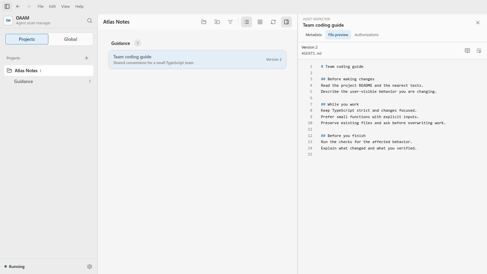

<div align="center">

# Open Agent Asset Manager

### あなたの資産。ツールは自由に選べる。

スキル、指示、ワークフローを、一つのコーディングツールに縛られない場所へ。

[English](../README.md) · [简体中文](README.zh-CN.md) · [日本語](README.ja.md) · [Deutsch](README.de.md)

[使い方](USAGE.ja.md) · [ソースから実行](#ソースから実行する) · [技術紹介](ARCHITECTURE.ja.md)

[](../LICENSE) · ソースプレビュー

</div>



*架空のデモプロジェクト Atlas Notes に保存されたチームガイドのプレビュー。*

## できること

**これまでの資産を持ち運ぶ**

再利用するスキルや指示を、関連ファイルごと一つのライブラリで管理します。

**適用する前に変更を確認する**

対象ツールを選び、ファイルの変更内容を確認してから適用します。

**改善を次のバージョンに残す**

対応する外部編集を取り込み、新しいバージョンとして保存します。

OAAM は **Guidance、Rule、Workflow、Skill、Subagent の宣言、Memory** を管理します。プロジェクト用とグローバル用のライブラリで所有範囲を分け、ディレクトリ形式のアセットでは関連リソース、相対パス、ファイルのバイト列、実行属性を保持します。

**Claude Code、Codex、Cursor、OpenCode、Antigravity、zcode** のアダプターがあります。利用できる操作は、App・CLI・IDE の具体的な入口、アセットの種類、OS、検出されたバージョンによって異なります。変換できない内容は明示し、情報が失われる変換は事前に確認します。

**設定もアセットと一緒に**

手動で呼び出したときだけ使う設定の Skill は、移行先でもその設定を保ちたいものです。OAAM はこの設定を本文とは別に記録し、対応する Claude Code・Cursor 向けの変換で保持できます。モデルや思考強度の指定も保存し、対象の分析に使います。[具体例と制限](ARCHITECTURE.ja.md#呼び出し方式)をご覧ください。

## 最初のワークフロー

1. プロジェクトを追加し、OAAM に読み取りを許可するツールの場所を選びます。
2. 既存の指示やスキルを取り込み、保存されたバージョンとファイルを確認します。
3. 別の対応ツールを選び、保存先と変更内容を確認して適用します。
4. 対応するファイルが OAAM の外で編集されたら、その変更を確認し、新しいバージョンとして保存します。

詳しくは[使い方ガイド](USAGE.ja.md)をご覧ください。スキャンやプレビューだけで変更が適用されることはありません。

## ソースから実行する

**Linux x64 の開発用プレビュー**には、**Node.js 22.14 以降**、npm、お使いの OS の C++ ビルドツールが必要です。Python、システムライブラリ、ネイティブモジュールの要件は[ビルドガイド](BUILD.ja.md)を参照してください。

```sh
git clone https://github.com/pseudoming/open-agent-asset-manager.git
cd open-agent-asset-manager
npm ci
npm run build
npm exec -- electron-rebuild -v 42.7.0 -m packages/core -o better-sqlite3
npm run start --workspace @oaam/client-desktop
```

ネイティブモジュールの手順で SQLite を Electron 用に準備します。その後 Node のテストを実行する場合は、ビルドガイドに従って再ビルドしてください。このプレビューにはダウンロード可能なデスクトップパッケージは含まれません。

## 現在の対象範囲

- デスクトップの主な対象は **Windows x64** と、ユーザーが明示的に選択した Ubuntu WSL x64 環境です。他の OS でソースをビルドできても、その OS での配布版の動作確認を意味しません。
- チャット本文、認証情報、プライベートセッション、プラグイン専用データ、ツールが管理する組み込みコンテンツは対象外です。

## 開発に参加する

具体的な利用場面、再現可能な問題、焦点を絞った改善を歓迎します。[ビルドとテストのガイド](BUILD.ja.md)を読んでから、Issue や Pull Request をお送りください。4 言語の README の改善も歓迎します。

レビュー済みの変更を一つの公開スナップショットにまとめる場合があります。貢献者が公開を希望する名前でクレジットを残します。

## ライセンス

OAAM 自身のコードは [Apache License 2.0](../LICENSE) で提供されます。第三者の依存ライブラリや取り込んだアセットには、それぞれのライセンスが適用されます。
